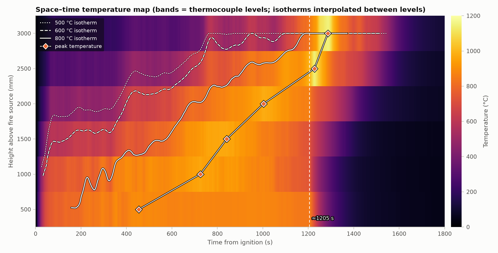
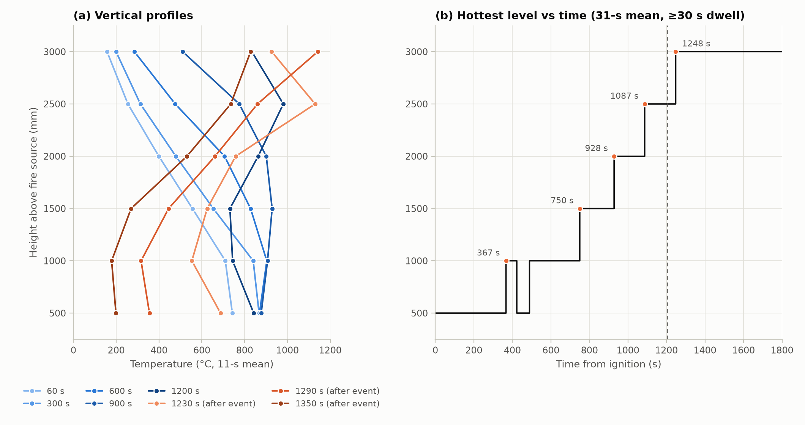
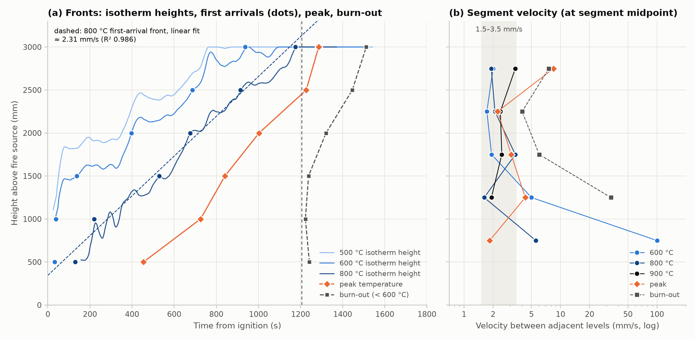
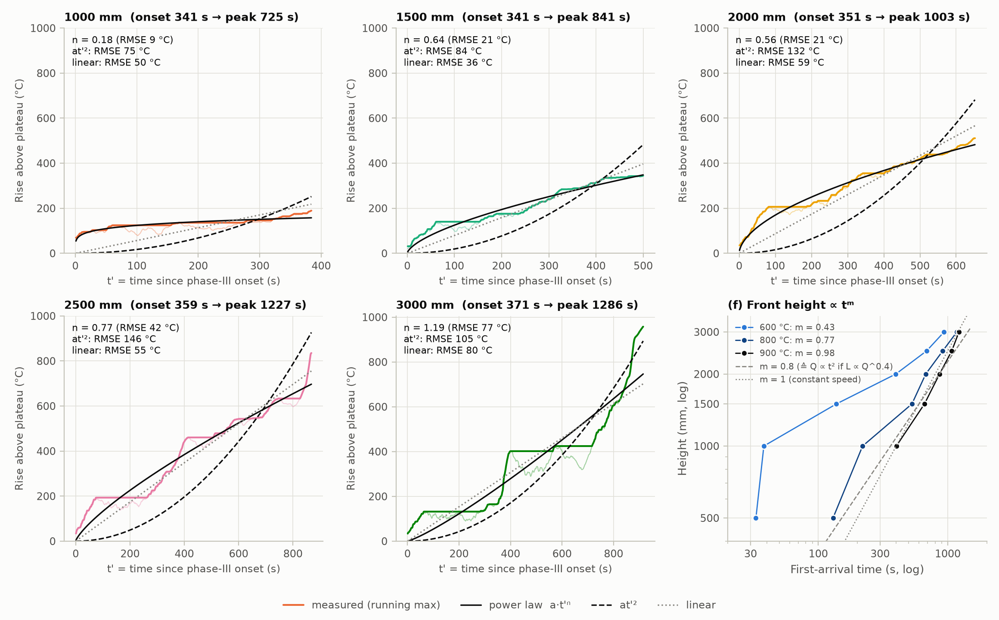
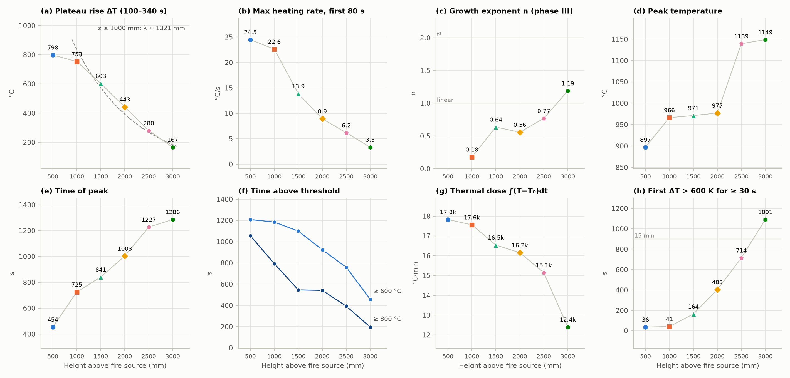
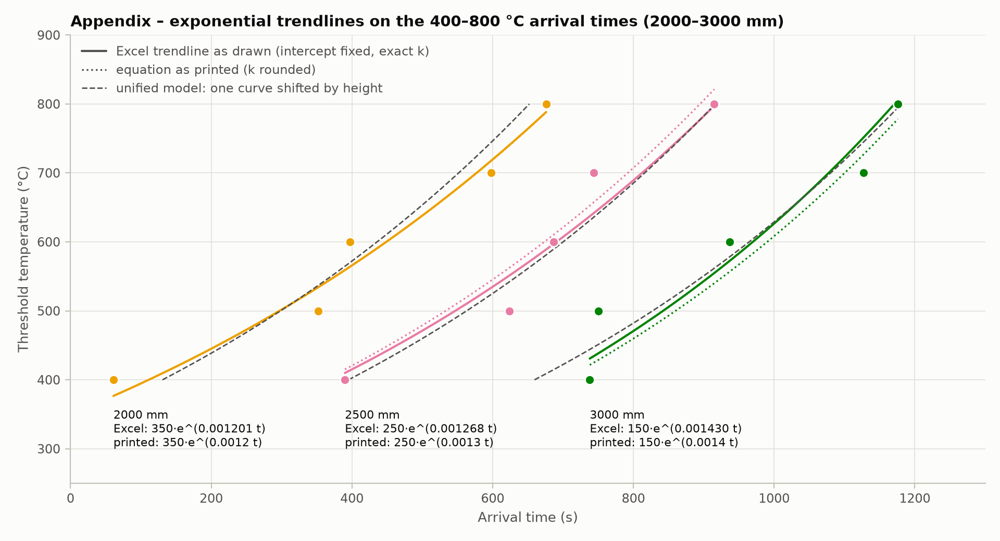

# 중공층(PIR) 화재시험 – 높이별 온도·화재확산·성장 경향 분석 (PIR_2, 500–3000 mm)

대상 자료는 `PIR 시험체 2 … Max.xlsx`(시트 `sc_2 max`)입니다. 화원 상부 **500·1000·1500·2000·2500·3000 mm** 6개 높이의 1 Hz 온도로그(0–1832 s)를 분석했습니다.
모든 수치·그림은 `python analysis.py`로 재현됩니다(→ [부록 B](#부록-b-재현-방법)).

## 0. 핵심 결론 – 화재경향성 요약

1. **3단계로 진행합니다.**
   - 화원 화염이 하부를 즉시 채우는 초기 단계(~1분)
   - 준정상 정체 단계(~6분)
   - 중공층을 따라 연소대가 위로 올라가는 확산 단계(6–20분)
   - 약 20분(≈1205 s)에 하부 급랭과 상부 급성장이 동시에 일어난 뒤, 아래부터 소진됩니다.
2. **화재확산 속도는 약 2.3–2.4 mm/s(≈14 cm/min)로 거의 일정**합니다.
   - 800·900 °C 전선은 500→3000 mm를 직선으로 이동합니다(선형 적합 R² 0.986–0.991).
   - 가장 뜨거운 높이는 1000 mm(367 s) → 1500(750) → 2000(928) → 2500(1087) → 3000 mm(1248 s) 순으로 이동했습니다.
3. **초기 화염 규모**: 1000 mm 이하는 1분 안에 약 780–820 °C에 도달하는 연속화염 영역입니다. 초기 화염선단(600 °C)은 약 1.6 m에 있습니다. 그 위의 온도상승은 높이에 대해 지수적으로 감쇠합니다(λ ≈ 1.3 m, 500 mm당 −32 %).
4. **높을수록 늦게, 짧게, 그러나 더 뜨겁게 연소합니다.**
   - 최고온도: 897 → 1149 °C로 상승
   - 최고온도 시각: 454 → 1286 s로 지연
   - 600 °C 이상 유지시간: 1209 → 458 s로 감소
5. **화원 종료(추정) 후 상부 재성장**: 1205 s에 500–2000 mm가 동시에 급랭(최대 −10 °C/s)하는 동안 2500·3000 mm는 오히려 **+8~10 °C/s로 급상승**해 1139·1149 °C로 최고온도를 기록했습니다. 온도 분포가 역전(상부가 최고온)되어, 상부 중공층이 **화원 없이도 연소를 지속·강화**했음을 시사합니다.
6. **at² 경향**
   - 각 높이의 온도 성장은 at²가 아닙니다. 성장 지수 n은 1000 mm 0.18 → 3000 mm 1.19로, 높이가 오를수록 감속형에서 가속형으로 바뀝니다.
   - 반면 **800 °C 화염대의 높이는 z ∝ t^0.77**로 커집니다. 화염높이–발열량 관계(L ∝ Q^(2/5))를 가정하면 **Q ∝ t^1.9 ≈ t²**에 해당합니다. 900 °C 기준으로는 t^2.4로, "t²와 부합하거나 그보다 약간 빠른 성장"으로 해석할 수 있습니다. α(kW/s²)를 정량화하려면 발열량(HRR) 자료가 필요합니다.

---

## 1. 데이터와 전처리

- 시간 `B`열(1 s 간격), 온도 `C–H`열 = PIR_2_500 … PIR_2_3000입니다. 결측은 없고 초기온도는 23.4–25.4 °C입니다.
- 1807 s부터 모든 채널이 5–8 s 만에 약 35 °C로 떨어집니다. 시험 종료(소화 등)로 판단해 **1800 s 이후는 제외**했습니다.
- 2000–3000 mm 값은 이전 파일(`test.xlsx`)과 **완전히 동일**합니다. 이전 요약표의 500–1500 mm 도달시간(600/700/800 °C)도 이 로그로 다시 계산해 일치함을 확인했습니다.
- 시트명 `sc_2 max`와 `A1 = max`로 보아, 각 높이 값은 여러 열전대 중 **최댓값**일 가능성이 있습니다. 이 경우 아래 속도는 "각 높이에서 가장 먼저 가열된 지점" 기준입니다.

## 2. 화재 진행 단계




| 단계 | 시간 | 관측 내용 |
|---|---|---|
| I. 초기 급상승 | 0–약 65 s | 전 높이가 동시에 상승하며, 57–67 s에 정체온도의 90 %에 도달합니다. 최대 가열속도는 24.5 (500 mm) → 3.3 °C/s (3000 mm)로 높이에 따라 감소합니다. |
| II. 정체 | 약 70–340 s | 824 / 777 / 627 / 466 / 304 / 191 °C(500→3000 mm)로 유지됩니다. 화원만으로 형성된 준정상 온도장입니다. |
| III. 상향 확산 | 341–371 s 시작 → 피크 | 성장이 **전 높이에서 거의 동시에 시작**됩니다(전체 발열 증가). 이후 연소대가 위로 이동하며, 350–370 s와 740–770 s에 계단식 상승이 있습니다. |
| IV. 상부 급성장 | ≈1205 s 이후 | 500–2000 mm는 급랭하고, 2500 mm(1227 s, 1139 °C)와 3000 mm(1286 s, 1149 °C)는 최고온도에 도달합니다. |
| V. 소진 | 1223–1512 s | 600 °C 미만 하강 시각은 1242 / 1223 / 1238 / 1321 / 1446 / 1512 s입니다. 하부 3개 높이가 동시에 먼저 소진되고, 이어 위로 진행합니다. |

- 시공간 지도(Fig 2)는 이 과정을 한눈에 보여 줍니다. 고온 영역(주황–노랑)이 오른쪽 위로 기울어진 띠를 이루며 올라가고, 약 1205 s 이후 하부는 어두워지는 반면 상부만 가장 밝아집니다.
- 1205 s 사건의 특징: 11 s 이동평균 기준으로 하부의 최대 냉각속도는 −8.0 / −9.7 / −4.8 / −5.5 °C/s(500–2000 mm)입니다. 같은 시점에 상부는 +8.2 °C/s(2500 mm, 1218 s), +9.7 °C/s(3000 mm, 1243 s)로 가열되었습니다. 여러 높이가 **동시에** 식기 시작했으므로 화원 종료(버너 소화 등)일 가능성이 높습니다. 시험기록으로 확인하시길 권합니다.

## 3. 수직 온도분포



| 시각 | 500 | 1000 | 1500 | 2000 | 2500 | 3000 mm | 최고온 높이 |
|---|---|---|---|---|---|---|---|
| 60 s | 743 | 710 | 556 | 399 | 255 | 157 | 500 |
| 300 s | 868 | 840 | 654 | 479 | 313 | 199 | 500 |
| 600 s | 870 | **904** | 828 | 706 | 476 | 285 | 1000 |
| 900 s | 877 | 907 | **929** | 901 | 775 | 511 | 1500 |
| 1200 s | 842 | 744 | 731 | 863 | **981** | 834 | 2500 |
| 1290 s | 355 | 316 | 445 | 662 | 860 | **1142** | 3000 |
| 1350 s | 199 | 179 | 270 | 531 | 735 | **828** | 3000 |

(°C, 11 s 평균)

- **초기(화원 지배) 분포**: 1000 mm 이하는 연속화염 영역입니다. 그 위의 정체온도 상승 ΔT는 **지수 감쇠**를 보입니다: ΔT ∝ exp(−z/λ), λ ≈ 1321 mm, R² 0.973, 500 mm당 −32 %.
- 정체구간 평균 등온선 높이(층간 선형보간)는 **800 °C ≈ 0.8 m, 600 °C ≈ 1.6 m, 500 °C ≈ 1.9 m**입니다. 화원 화염이 중공층에서 약 1.6–1.9 m 길이로 형성되어 있었다고 볼 수 있습니다.
- **분포의 이동과 역전**: 최고온 높이는 시간이 지나며 한 칸씩 위로 옮겨갑니다(Fig 3b). 1248 s 이후에는 3000 mm가 최고온인 **역전 분포**가 끝까지 유지됩니다.

## 4. 화재확산 속도



### 4.1 등온 도달시간 (첫 도달, s)

| 기준 | 500 | 1000 | 1500 | 2000 | 2500 | 3000 mm |
|---|---|---|---|---|---|---|
| 300 °C | 15 | 17 | 26 | 47 | 74 (176\*) | 421 |
| 400 °C | 21 | 22 | 38 | 61 | 390 | 738 |
| 500 °C | 26 | 29 | 53 | 352 | 624 | 750 |
| 600 °C | 33 | 38 | 138 | 397 | 687 | 937 (1084\*) |
| 700 °C | 45 | 57 | 365 | 598 | 744 | 1127 (1137\*) |
| 800 °C | 130 (192\*) | 220 (281\*) | 529 (578\*) | 676 | 915 | 1176 |
| 900 °C | – | 401 (597\*) | 661 | 864 (891\*) | 1074 | 1221 |
| 1000 °C | – | – | – | – | 1207 | 1242 |

\* 괄호 안은 "30 s 이상 지속" 기준 값이며, 첫 도달과 다를 때만 표기했습니다.

### 4.2 인접 높이 간 속도 Δz/Δt (mm/s)

| 전선 | 500→1000 | 1000→1500 | 1500→2000 | 2000→2500 | 2500→3000 |
|---|---|---|---|---|---|
| 600 °C | 100 | 5.00 | 1.93 | 1.72 | 2.00 |
| 700 °C | 41.7 | 1.62 | 2.15 | 3.42 | 1.31 |
| 800 °C | 5.56 | 1.62 | 3.40 | 2.09 | 1.92 |
| 900 °C | – | 1.92 | 2.46 | 2.38 | 3.40 |
| 최고온 높이 이동 | – | 1.31 | 2.81 | 3.14 | 3.11 |
| 최고온도(피크) 시각 | 1.85 | 4.31 | 3.09 | 2.23 | **8.47** |
| 소진(<600 °C) | 동시 | 33.3 | 6.02 | 4.00 | 7.58 |

### 4.3 전 높이 회귀 (z = z₀ + v·t, 500–3000 mm)

| 전선 | 속도 v | R² | 비고 |
|---|---|---|---|
| 600 °C | 2.40 mm/s | 0.923 | 하부는 거의 동시 도달, 1500→3000 mm 구간 평균 1.88 mm/s |
| 700 °C | 2.18 mm/s | 0.960 | 1500→3000 mm 구간 평균 1.97 mm/s |
| **800 °C** | **2.31 mm/s** | **0.986** | 500→3000 mm 구간 평균 2.39 mm/s |
| **900 °C** | **2.41 mm/s** | **0.991** | 1000→3000 mm 구간 평균 2.44 mm/s |

**해석**

- **600 °C 이하 전선**은 하부가 화원 화염에 즉시 잠기므로 0.5→1.5 m 구간이 매우 빠르고(수십 mm/s), 그 위에서 약 2 mm/s로 느려집니다.
- **800–900 °C 전선(화염대·연소대)**은 처음부터 끝까지 **약 2.3–2.4 mm/s로 거의 일정**합니다. 이 값을 "중공층 연소대의 상향 확산속도"로 쓰는 것이 가장 안정적입니다. 이 속도로 **1.5 m를 오르는 데 약 10–11분**이 걸립니다.
- 최상부(2500→3000 mm)에서는 피크(8.5 mm/s), 소진(7.6 mm/s), 1000 °C 전선(14 mm/s)이 **가속**합니다. 1205 s 사건 이후 상부가 빠르게 연소하고 소진된 결과입니다.
- 계단식 상승이 여러 높이에서 동시에 나타나므로, 등온 도달시간 기반 속도에는 화염 이동과 전체 발열 증가가 섞여 있습니다(겉보기 속도).

## 5. 성장 특성과 at² 검토



### 5.1 높이별 온도 성장 (III단계, 정체온도 대비 상승량 ΔT = a·t′ⁿ)

| 높이 | 1000 | 1500 | 2000 | 2500 | 3000 mm |
|---|---|---|---|---|---|
| **성장 지수 n** | **0.18** | **0.64** | **0.56** | **0.77** | **1.19** |
| 멱법칙 RMSE | 9 °C | 21 °C | 21 °C | 42 °C | 77 °C |
| at′² RMSE | 75 °C | 84 °C | 132 °C | 146 °C | 105 °C |
| 선형 RMSE | 50 °C | 36 °C | 59 °C | 55 °C | 80 °C |
| 참고: 원점 자유 시 n | 0.72 | 1.16 | 0.69 | 1.00 | 2.10 (원점 0 s) |

(500 mm는 III단계 상승이 73 °C뿐이라 제외했습니다. 이미 화염 속에 있는 높이입니다.)

- **높이가 오를수록 감속형 → 선형 → 가속형으로 바뀝니다.** 하부는 화염온도 부근에서 포화하고, 상부는 연소대가 다가오며 점점 빨리 가열됩니다.
- **온도의 at²는 성립하지 않습니다.** 성장 시작점을 원점으로 잡으면 모든 높이에서 at′²가 멱법칙·선형보다 오차가 큽니다. 최상부(3000 mm)만 원점을 점화 시점으로 옮기면 n≈2.1이 되어 대략적인 포락선으로 쓸 수 있습니다.

### 5.2 화염대 높이의 성장 (Fig 5f, z ∝ tᵐ)

| 기준 | m (log–log) | R² | Q 성장지수 (L ∝ Q^(2/5) 가정) | Q′ 성장지수 (L ∝ Q′^(2/3) 가정) |
|---|---|---|---|---|
| 600 °C | 0.43 | 0.898 | 1.08 | 0.65 |
| 800 °C | **0.77** | 0.976 | **1.91 ≈ 2** | 1.15 |
| 900 °C | 0.98 | 0.992 | 2.44 | 1.46 |

- 고온(800–900 °C) 화염대 높이는 **t^0.8–t^1.0**으로 성장합니다. 점화원형 화염높이 상관식을 적용하면 발열량이 **t²–t^2.4**로 증가한 것에 해당합니다. 즉 **t² 화재 또는 그보다 약간 빠른 성장**과 부합합니다.
- 다만 중공층처럼 좁은 공간의 화염은 선형(line) 화염 스케일(L ∝ Q′^(2/3))에 가까울 수 있고, 그 경우 성장지수는 1.2–1.5로 낮아집니다. 또한 선형 모델(일정 속도)도 R² 0.986–0.991로 비슷하게 잘 맞습니다. 따라서 **"at²에 가까운 가속 성장" 정도로 논하고, α 값은 HRR 측정으로 확정**하는 것이 안전합니다.

## 6. 높이별 경향 종합



| 지표 | 500 | 1000 | 1500 | 2000 | 2500 | 3000 mm | 경향 |
|---|---|---|---|---|---|---|---|
| 초기 최대 가열속도 (°C/s) | 24.5 | 22.6 | 13.9 | 8.9 | 6.2 | 3.3 | ↓ |
| 정체구간 ΔT (°C) | 798 | 753 | 603 | 443 | 280 | 167 | 1 m 이상에서 지수 감쇠 |
| 성장 지수 n | – | 0.18 | 0.64 | 0.56 | 0.77 | 1.19 | ↑ (감속 → 가속) |
| 최고온도 (°C) | 897 | 966 | 971 | 977 | 1139 | 1149 | ↑ (상부 1100 °C 이상) |
| 최고온도 시각 (s) | 454 | 725 | 841 | 1003 | 1227 | 1286 | ↑ (연소대 상승) |
| 600 °C 이상 유지 (s) | 1209 | 1185 | 1100 | 924 | 759 | 458 | ↓ |
| 800 °C 이상 유지 (s) | 1056 | 793 | 546 | 542 | 393 | 196 | ↓ |
| 열노출량 ∫(T−T₀)dt (°C·min) | 17,831 | 17,563 | 16,542 | 16,155 | 15,146 | 12,399 | 완만히 ↓ (−30 %) |
| ΔT > 600 K가 30 s 지속된 첫 시각 (s) | 36 | 41 | 164 | 403 | 714 | 1091 | ↑ |

## 7. 화재경향성 논의 (보고서·논문용 논점)

1. **화원 화염과 중공층 연돌효과**: 점화 1분 안에 하부 1 m가 연속화염(약 800 °C)에 잠기고, 화염선단은 약 1.6–1.9 m까지 올라옵니다. 그 위 고온가스의 온도는 λ ≈ 1.3 m로 지수 감쇠합니다. 좁은 중공층 안에서 화염이 길게 늘어나고, 벽면으로 열을 잃으며 식는 전형적인 양상으로 볼 수 있습니다.
2. **자기확산(self-propagating) 연소대**: 약 6분 이후 PIR이 연소에 가담하면서 연소대가 **2.3–2.4 mm/s의 일정 속도**로 올라갑니다. 연소대(800 °C)보다 앞선 500–600 °C 예열 영역은 높이별로 약 4–8분 먼저 도달합니다. PIR은 탄화층을 형성하는 단열재로 알려져 있으며, mm/s 수준의 느리고 일정한 확산은 이 특성과 부합합니다.
3. **"높을수록 늦게, 짧게, 더 뜨겁게"**: 하부는 오래(600 °C 이상 약 20분) 가열되는 **장시간 노출형**입니다. 상부는 늦게 시작해 짧지만 **1100 °C 이상의 고강도 연소형**입니다. 설계 관점에서 하부는 내화 지속시간, 상부는 순간 최고온도와 확산 차단이 핵심 쟁점이 됩니다.
4. **화원 종료(추정) 후 상부 연소 강화**: 약 20분에 하부가 급랭하는 동안 상부 2500–3000 mm가 오히려 +8~10 °C/s로 급가열되어 최고온도를 기록했습니다. 상부 중공층에 축적된 열분해가스·미연소 연료가 화원 없이도 연소를 지속·강화할 수 있다는 뜻입니다. 이는 **중공층 내부 화재확산 방지구조(캐비티 배리어)**의 필요성을 뒷받침하는 근거로 논의할 수 있습니다.
5. **연소대 상승 → 하부 소진**: 최고온 높이와 소진 전선이 모두 아래에서 위로 이동합니다. 즉 연료가 아래부터 소진되며 연소대가 위로 올라가는 "이동 연소대(moving burning zone)" 형태입니다.
6. **판정기준 관점(참고)**: KS F 8414·BS 8414 계열의 "ΔT 600 K, 30 s 지속, 15분 이내" 개념을 각 높이에 적용해 봤습니다. 2500 mm까지는 15분 이내(714 s)에 해당하고, 3000 mm는 18.2분(1091 s)에 해당합니다. 본 시험의 측정 높이와 시험 방법은 해당 규격(레벨 2 = 개구부 상단 5 m 등)과 다르므로 **판정이 아닌 비교 지표**로만 쓰시길 권합니다.

## 8. 한계와 추가 분석 제안

- **시험 1회** 결과입니다. 반복시험이나 다른 시험체(예: PIR_1, 타 단열재)와 비교해야 경향의 일반성과 유의성을 말할 수 있습니다. 같은 형식의 엑셀이면 `analysis.py`로 바로 분석됩니다.
- **높이 간격 500 mm**라 등온선 높이는 층간 선형보간값입니다(±250 mm 해상도).
- **온도 ≠ 발열량**: at²의 α 분류(slow/medium/fast/ultra-fast)를 하려면 HRR(산소소모법)이나 질량감소 자료가 필요합니다.
- 1205 s 사건, 350·740 s 계단 상승은 **시험기록·영상**(화원 출력 변경·종료, 마감재 탈락, 착화 시점)과 대조해야 해석이 확정됩니다.
- 도달시간 기준(첫 도달 vs 30 s 지속)에 따라 일부 값이 최대 196 s(900 °C, 1000 mm) 달라집니다. 보고서에는 사용한 기준을 명시하십시오.

---

## 부록 A. 엑셀 지수 추세선 점검 (이전 차트, 2000–3000 mm)



- **라벨**: 가장 빠른 곡선(61→676 s)이 **2000 mm**, 가장 늦은 곡선(738→1176 s)이 **3000 mm**입니다. 따라서 `350e^0.0012x`는 2000 mm, `250e^0.0013x`는 2500 mm, `150e^0.0014x`는 3000 mm에 해당합니다.
- **추세선 설정**: 이전 `test.xlsx`의 chart3는 **절편 고정(Set Intercept) 350/250/150**으로 설정되어 있습니다. 실제 k는 **0.001201 / 0.001268 / 0.001430**이고, 표시식과 그려진 곡선의 차이는 최대 0.6 / 24.0 / 27.5 °C입니다.
- **k 경향**: 높이별 k 경향은 A 고정의 산물입니다. 모든 높이에 A=250을 적용하면 k = 0.00184 / 0.00127 / 0.00091로 경향이 뒤집힙니다.
- **대안 모형 비교**: 400–800 °C 다섯 점만으로는 지수·at²·선형(RMSE 38–54 s)이 구분되지 않습니다. at²를 맞추면 잠복시간이 음수(−1259 / −653 / −456 s)로 나옵니다.
- **통합 모델**: t = 131 + 0.529·(h − 2000) + 752·ln(T/400) [s]
  - 공통 k = 0.00133 s⁻¹ (95 % CI 0.00114–0.00160)
  - 상향 이동속도 1.89 mm/s (95 % CI 1.65–2.21) — §4의 속도와 일치합니다.
  - 높이별 k를 따로 두는 것은 유의하지 않습니다(p = 0.47).
- **`test.xlsx` chart1**: X 범위(`K2:K5`)와 Y 범위(`Q3:Q5`)의 길이가 달라 점이 한 칸씩 밀려 그려집니다. Y를 `Q2:Q5`로 바꾸면 됩니다.

## 부록 B. 재현 방법

```bash
cd hollow_layer_fire
pip install -r requirements.txt
python analysis.py --xlsx data/PIR_2_max.xlsx     # figures/, results/ 생성
```

- 입력 형식: 시트 `sc_2 max`, 시간 열 헤더 `s`, 온도 열 헤더 `PIR_<번호>_<높이mm>`. 다른 시험체도 같은 형식이면 그대로 분석됩니다.
- 산출물(`results/`):
  - `phase_metrics.csv` – 높이별 단계 지표
  - `arrival_times.csv` – 등온 도달시간(첫 도달·30 s 지속)
  - `spread_velocity.csv`, `front_fits.csv` – 속도
  - `growth_fits.csv` – 성장식
  - `vertical_profiles.csv`, `isotherm_heights.csv`(10 s 간격 등온선 높이·최고온 높이)
  - `summary.json`
- 원본 엑셀(`data/*.xlsx`)은 **공개 저장소이므로 커밋하지 않습니다**(`.gitignore`).
