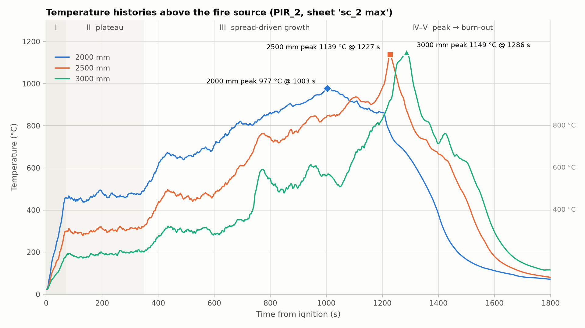
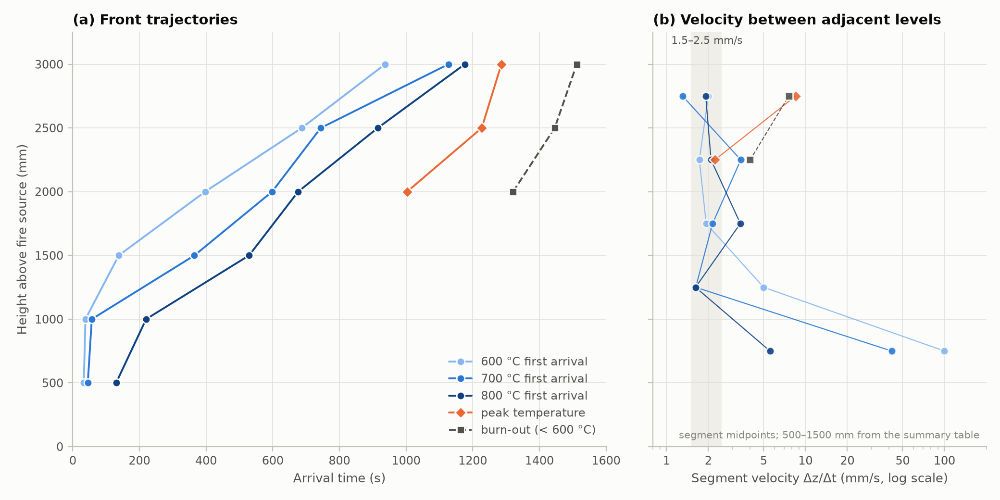
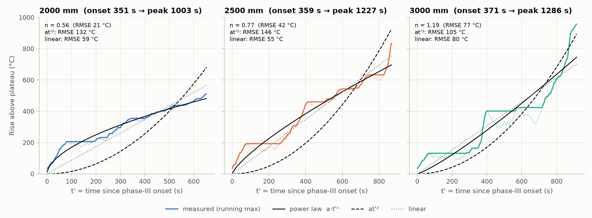
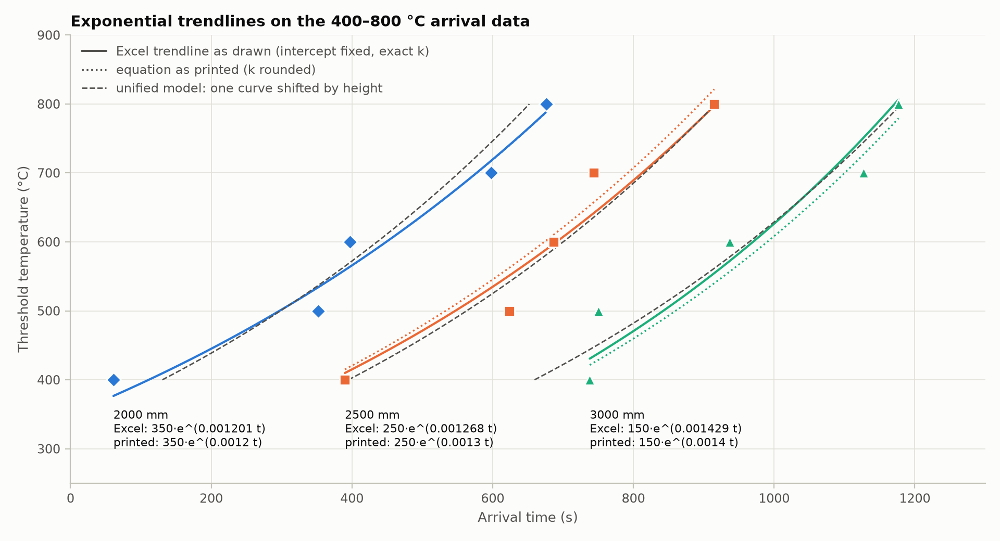
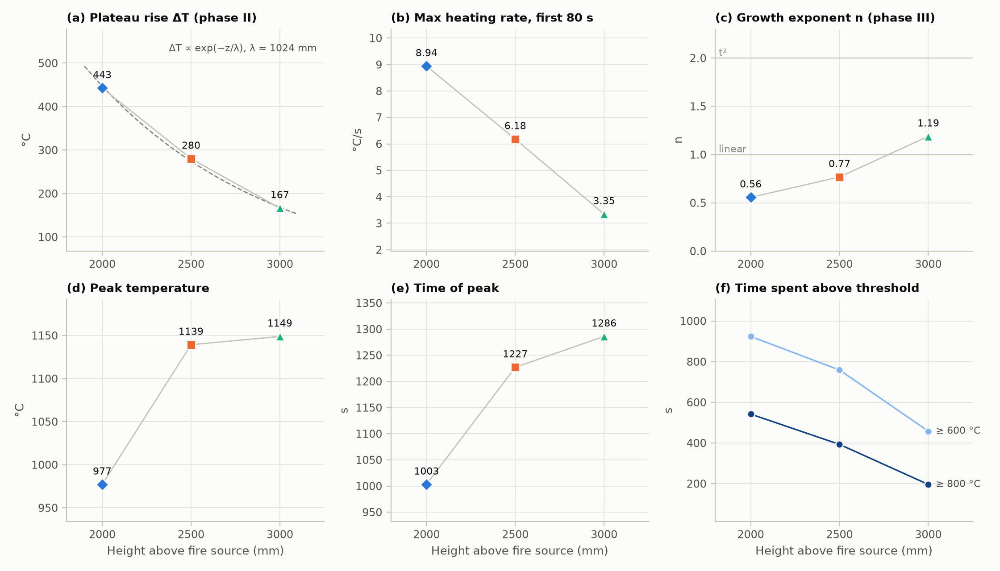

# 중공층(PIR) 화재시험 – 화원 상부 높이별 온도·화재확산 분석

`test.xlsx`(시트 `sc_2 max`)를 분석했습니다. 대상은 2000/2500/3000 mm 지점의 1 Hz 온도로그와, 500–3000 mm 지점의 600/700/800 °C 도달시간 요약표입니다.
모든 수치와 그림은 `python analysis.py`로 다시 만들 수 있습니다(→ [재현 방법](#7-재현-방법)).

## 0. 한눈에 보기

| 항목 | 결과 |
|---|---|
| **라벨 정정** | 가장 먼저 가열되는(맨 왼쪽) 곡선이 **2000 mm**, 맨 오른쪽 곡선이 **3000 mm**입니다(엑셀 원자료 기준). 아래 지점이 먼저 가열되므로 **상향 확산**입니다. |
| **화재확산 속도** | 1000 mm 이하는 화원 화염에 바로 잠기는 구간으로, 600 °C 도달이 33–38 s입니다. **1500→3000 mm 구간은 약 1.9–2.3 mm/s(≈0.11–0.14 m/min)로 거의 일정하게 상승**합니다. 최상부에서는 피크·소진 전선이 **2→8 mm/s로 가속**합니다. |
| **at² 적합성** | 온도 성장 형태가 높이에 따라 달라집니다. **2000 mm는 감속(포화)형(n≈0.56), 2500 mm는 선형에 가까움(n≈0.77), 3000 mm는 가속형(n≈1.19)**입니다. 성장 시작점부터 잰 **at²(n=2)는 어느 높이에서도 맞지 않습니다**(RMSE 105–146 °C). 3000 mm에서 시간 원점을 점화 시점으로 끌어오면 n≈2.1이 되므로, at²는 최상부의 "대략적인 포락선" 정도로만 쓸 수 있습니다. |
| **엑셀 지수식** | 추세선 절편이 **350/250/150으로 고정(Set Intercept)**되어 있습니다. 표시된 지수 k는 반올림 값이고, 실제 값은 0.001201/0.001268/0.001429입니다. 높이별 k 경향은 **A를 고정한 방식이 만든 결과**이며, 모든 높이에 A=250을 적용하면 경향이 뒤집힙니다. |
| **통합 모델** | 3개 높이의 400–800 °C 도달시간은 **하나의 가열곡선이 높이에 따라 지연된 형태**로 설명됩니다. t = 131 + 0.529·(h−2000) + 752·ln(T/400) [s]이며, 이로부터 구한 상향 이동속도는 **1.89 mm/s (95 % CI 1.65–2.21)**입니다. 높이별로 k를 따로 두는 것은 통계적으로 유의하지 않습니다(p=0.47). |
| **기타 경향** | 높이가 올라갈수록 다음과 같이 변합니다. 초기 가열속도 8.9 → 6.2 → 3.4 °C/s로 감소, 정체구간 온도상승 443 → 280 → 167 °C로 지수적 감쇠(λ≈1.0 m), 최고온도 977 → 1139 → 1149 °C로 증가, 600 °C 이상 유지시간 924 → 759 → 458 s로 감소. |

---

## 1. 데이터와 확인 사항

- **온도로그**: `B`열이 시간(0–1832 s, 1 s 간격), `F/G/H`열이 PIR_2_2000/2500/3000입니다(초기온도 23.5/23.7/24.6 °C). 1807 s부터 모든 채널이 5–8 s 만에 약 35 °C로 급락하는데, 이는 시험 종료(소화 등)로 판단해 **1800 s 이후는 제외**했습니다.
- **요약표**(`K1:Q5`): 500–3000 mm의 600/700/800 °C 도달시간입니다. 2000–3000 mm 값은 로그에서 다시 계산한 "첫 도달 시각"과 **정확히 일치(차이 0 s)**했습니다. 500–1500 mm는 로그가 없어 요약표 값을 그대로 썼습니다.
- **라벨 정정**: 차트 원자료(`K13:P18`)와 차트 XML 기준으로 각 식은 다음 높이에 해당합니다.
  - `y = 350e^0.0012x` → **PIR_2_2000** (61, 352, 397, 598, 676 s)
  - `y = 250e^0.0013x` → **PIR_2_2500** (390, 624, 687, 744, 915 s)
  - `y = 150e^0.0014x` → **PIR_2_3000** (738, 750, 937, 1127, 1177 s)
- **엑셀 차트 점검**
  1. `chart3`(지수 추세선): 세 계열 모두 **"절편 설정(Set Intercept)"을 350/250/150으로 지정**한 상태입니다. 레이블은 `General` 서식이라 k가 두 자리로 반올림되어 보입니다. 표시된 식과 실제 그려진 곡선의 차이는 최대 **0.6/24.0/27.2 °C**(2000/2500/3000 mm)입니다.
  2. `chart1`(6개 높이): X 범위가 `K2:K5`(0 포함 4개), Y 범위가 `Q3:Q5`(3개)로 **길이가 맞지 않습니다**. 그 결과 (0 s → 600 °C), (600 °C 도달시간 → 700 °C)처럼 **한 칸씩 밀려** 그려집니다. Y를 `Q2:Q5`로 바꾸면 해결됩니다.
  3. `chart2`: PIR_2_2000에 2차 다항 추세선(식 비표시)이 적용되어 있습니다.

## 2. 온도이력의 단계 구분



| 구분 | 2000 mm | 2500 mm | 3000 mm |
|---|---|---|---|
| I. 초기 급상승 최대 가열속도(0–80 s, 11 s 이동평균) | 8.94 °C/s | 6.18 °C/s | 3.35 °C/s |
| II. 정체구간 평균온도(100–340 s) | 466 ± 13 °C | 304 ± 10 °C | 191 ± 10 °C |
| II. 정체구간 온도상승 ΔT | 443 °C | 280 °C | 167 °C |
| III. 성장구간 시작(정체+30 °C) | 351 s | 359 s | 371 s |
| IV. 최고온도 / 시각 | **977 °C / 1003 s** | **1139 °C / 1227 s** | **1149 °C / 1286 s** |
| 600 °C 이상 유지시간 | 924 s | 759 s | 458 s |
| 800 °C 이상 유지시간 | 542 s | 393 s | 196 s |
| V. 피크 후 600 °C 미만 하강 시각 | 1321 s | 1446 s | 1512 s |

- **I (0–70 s)**: 세 높이가 동시에 가열되어 높이별 정체온도까지 빠르게 오릅니다. 화원의 화염·플룸에 의한 가열입니다. 2000 mm의 400 °C 도달(61 s)은 이 단계에서 일어났고, 2500·3000 mm의 400 °C 도달은 III단계에서 일어났습니다. 따라서 **같은 400 °C라도 가열 기구가 다릅니다.**
- **II (70–350 s)**: 온도가 거의 일정하게 유지됩니다. 정체온도 상승 ΔT는 높이에 대해 **지수적으로 감쇠**합니다: ΔT ∝ exp(−z/λ), **λ ≈ 1024 mm**, 500 mm당 −39 %. 거듭제곱으로 표현하면 z^−2.4로, 자유공간 플룸 이론(z^−5/3)보다 감쇠가 가파릅니다. 중공층 벽면으로의 열손실 영향으로 추정됩니다(측정점 3개이므로 경향 수준의 해석입니다).
- **III (350 s → 피크)**: 350–370 s에는 세 높이 모두, 740–770 s에는 특히 2500·3000 mm가 **거의 동시에 계단식으로 상승**합니다. 국소 화염 도착이라기보다 전체 발열량이 늘어나는 사건(화원 출력 변화 또는 하부 PIR 착화 등)으로 보이므로, 시험기록·영상과 대조해 보시길 권합니다.
- **IV–V**: 피크와 소진(하강)이 **아래에서 위로 이동**합니다. 하부 연료가 먼저 소진되고 연소대가 상부로 올라가는 양상입니다.

## 3. 화재확산 속도



### 3.1 등온 도달시간 (첫 도달 시각, s)

| 기준온도 | 500 mm | 1000 mm | 1500 mm | 2000 mm | 2500 mm | 3000 mm |
|---|---|---|---|---|---|---|
| 400 °C | – | – | – | 61 | 390 | 738 |
| 500 °C | – | – | – | 352 | 624 | 750 |
| 600 °C | 33 | 38 | 138 | 397 | 687 | 937 (1084\*) |
| 700 °C | 45 | 57 | 365 | 598 | 744 | 1127 (1137\*) |
| 800 °C | 130 | 220 | 529 | 676 | 915 | 1176 |
| 900 °C | – | – | – | 864 (891\*) | 1074 | 1221 |
| 1000 °C | – | – | – | 미도달 | 1207 | 1242 |

\* 괄호 안은 "30 s 이상 지속" 기준(KS F 8414 / BS 8414 판정 방식)으로 잰 값이며, 첫 도달 시각과 다를 때만 표기했습니다. 500–1500 mm 값은 요약표에서 가져왔습니다.

### 3.2 인접 높이 간 확산속도 Δz/Δt (mm/s)

| 전선(front) | 500→1000 | 1000→1500 | 1500→2000 | 2000→2500 | 2500→3000 |
|---|---|---|---|---|---|
| 400 °C | | | | 1.52 | 1.44 |
| 500 °C | | | | 1.84 | 3.97 |
| 600 °C | 100 | 5.00 | 1.93 | 1.72 | 2.00 (30 s 지속: 1.26) |
| 700 °C | 41.7 | 1.62 | 2.15 | 3.42 | 1.31 (30 s 지속: 1.27) |
| 800 °C | 5.56 | 1.62 | 3.40 | 2.09 | 1.92 |
| 900 °C | | | | 2.38 | 3.40 |
| 1000 °C | | | | – | 14.3 |
| 최고온도(피크) | | | | 2.23 | **8.47** |
| 소진(600 °C 미만 하강) | | | | 4.00 | **7.58** |

구간 평균속도(총 거리 / 총 시간):

| 기준 | 500→1500 mm | **1500→3000 mm** | 500→3000 mm |
|---|---|---|---|
| 600 °C | 9.52 | **1.88** | 2.77 |
| 700 °C | 3.12 | **1.97** | 2.31 |
| 800 °C | 2.51 | **2.32** | 2.39 |

**해석**

1. **두 개의 영역**: 1000 mm 이하는 화원 화염 안에 있어 600·700 °C에 33–57 s 만에 도달합니다(수십 mm/s 이상, 사실상 동시). 1500 mm 이상에서는 **약 2 mm/s(1.3–3.4 mm/s)의 느리고 거의 일정한 상향 확산**이 나타납니다. 1.5 m를 오르는 데 약 11–13분이 걸리는 속도입니다.
2. **최상부 가속**: 등온 전선의 속도는 대체로 일정합니다. 반면 **피크 전선은 2.2→8.5 mm/s, 소진 전선은 4.0→7.6 mm/s, 1000 °C 전선은 2500→3000 mm에서 14 mm/s**로 빨라집니다. 예열된 상부 중공층이 후반부에 한꺼번에 연소에 가담하는 양상입니다.
3. **겉보기(apparent) 속도라는 점에 유의**: II→III 전환(350–370 s)은 세 높이에서, 740–770 s 계단 상승은 2500·3000 mm에서 거의 동시에 일어납니다. 따라서 등온 도달시간으로 구한 속도에는 "화염 선단의 이동"과 "전체 발열 증가 + 수직 온도구배"가 섞여 있습니다. 순수한 화염전파 속도로 보려면 영상 관측이나 발열량 자료와 함께 해석해야 합니다.
4. **판정 기준에 따른 민감도**: 3000 mm의 600 °C 도달은 첫 도달이면 937 s, 30 s 지속이면 1084 s입니다. 이 차이로 2500→3000 mm 속도가 2.0에서 1.26 mm/s로 바뀝니다. 보고서에서는 기준을 명시하시길 권합니다.
5. 참고로 PIR은 일반적으로 탄화층을 형성하는 열경화성 단열재로 알려져 있어, mm/s 수준의 느린 확산은 이 재료 특성과 부합합니다.

## 4. 성장식 검토: at², 지수, 멱법칙

### 4.1 전체 이력(III단계) 기준 – 높이별 성장 형태



III단계(성장 시작 → 피크)의 누적최대(running max) 온도에서 정체온도를 뺀 값에 다음 식들을 맞췄습니다. t′는 성장 시작부터의 시간입니다.
(누적최대 곡선은 "각 온도에 처음 도달한 시각"을 연속적으로 이은 것이므로 도달시간 분석과 일관됩니다.)

| 모델 (ΔT = …) | 2000 mm | 2500 mm | 3000 mm |
|---|---|---|---|
| **멱법칙 a·t′ⁿ → 지수 n** | **0.56** (RMSE 21 °C) | **0.77** (42 °C) | **1.19** (77 °C) |
| at′² → a [°C/s²] | 1.60×10⁻³ (RMSE 132 °C) | 1.23×10⁻³ (146 °C) | 1.07×10⁻³ (105 °C) |
| 선형 r·t′ → r [°C/s] | 0.87 (59 °C) | 0.87 (55 °C) | 0.77 (80 °C) |
| 참고: 원점도 자유로 둔 멱법칙 | n=0.69 (원점 300 s) | n=1.00 (250 s) | **n=2.10 (원점 0 s)** |

- **높이별 형태 변화가 핵심 경향입니다.** 2000 mm는 약 1000 °C를 향해 포화하는 감속형(n<1), 2500 mm는 선형에 가까운 형태, 3000 mm는 화염이 다가오며 빨라지는 가속형(n>1)입니다.
- **at²(n=2)**: 성장 시작점을 원점으로 잡으면 세 높이 모두 멱법칙·선형보다 오차가 크게 나옵니다. 3000 mm에서 원점을 점화 시점(t≈0)까지 옮길 때만 n≈2.1이 나오므로, at²는 최상부 성장의 **대략적인 포락선** 정도로만 쓸 수 있습니다.
- **해석(가설)**: 하부 측정점은 연속화염 영역에 있어 온도가 화염온도 부근에서 포화합니다. 상부는 플룸·화염선단 영역이라 발열이 커질수록 온도가 점점 빠르게 오릅니다. 참고로 자유 플룸에서는 ΔT ∝ Q^(2/3)이므로, 발열량이 Q = αt²로 커지면 온도는 약 t^(4/3)로 증가합니다. **온도의 지수 n은 발열량 성장계수 α와 1:1로 대응하지 않으므로**, α(kW/s²)를 구하려면 발열량(HRR) 측정값이 필요합니다.
- III단계 곡선은 **계단형**(급상승–정체 반복)이라 어떤 매끈한 식도 21–77 °C 수준의 오차가 남습니다. 필요하면 계단 발생 시각(≈350, 740 s)과 1050 s 이후의 급상승을 사건 단위로 나눠 분석하는 방법을 권합니다.

### 4.2 400–800 °C 도달시간(엑셀 차트 데이터) 기준

온도 기준은 고정값이고 측정되는 것은 시간이므로, **시간 오차(RMSE, s)**로 비교했습니다(높이당 5점).

| 모델 | 2000 mm | 2500 mm | 3000 mm |
|---|---|---|---|
| 엑셀 추세선(A 고정, k만 적합) | 42.0 | 46.9 | 54.3 |
| 엑셀 표시식(k 반올림) | 42.0 | 48.9 | 59.0 |
| 지수 A·e^(kt) (A, k 자유) | 40.6 | 38.4 | 54.1 |
| at² : t = t₀ + √(ΔT/a) | 45.1 | 40.2 | 49.2 |
| 선형 | 51.7 | 43.3 | 45.6 |
| 통합 모델(세 높이 합쳐 3개 파라미터) | 48.8 | 42.7 | 54.9 |

- 두 파라미터 모델들은 **RMSE 38–54 s로 모두 비슷해 통계적으로 구분되지 않습니다.** 5개 점만으로는 지수함수가 특별히 더 적합하다고 말할 근거가 없습니다.
- at²를 맞추면 잠복시간 t₀가 **−1259 / −653 / −458 s(음수)**로 나와 물리적으로 의미가 없습니다. 즉 이 5개 점은 "점화 시점부터의 at²"로는 설명되지 않습니다.

### 4.3 엑셀 지수 추세선 점검과 통합 모델



- **실제 k**: 2000/2500/3000 mm = **0.001201 / 0.001268 / 0.001429** s⁻¹ (표시값 0.0012/0.0013/0.0014)
- **k 경향은 A를 고정한 방식 때문에 생깁니다**: 세 높이 모두 A=250으로 고정하면 k = 0.001839 / 0.001268 / 0.000909가 되어 경향이 **반대로** 나옵니다. A(t=0에서의 온도)는 150–350 °C로, 실제 초기온도(약 24 °C)와 맞지 않는 **적합용 상수**이므로 400–800 °C 범위 밖으로 외삽하면 안 됩니다.
- **통합 모델(권장)**: 세 높이의 도달시간 15점을 한 식으로 표현합니다.

  t(T, h) = 131 + 0.529·(h − 2000) + 752·ln(T / 400)  [s], 즉 T = 400·exp{0.00133·[t − 131 − 0.529·(h − 2000)]}

  - 공통 k = **0.00133 s⁻¹** (95 % CI 0.00114–0.00160). 400→800 °C까지 약 522 s가 걸립니다.
  - 높이 지연 0.529 s/mm → **상향 이동속도 1.89 mm/s (95 % CI 1.65–2.21)**. §3의 등온 전선 속도(1.9–2.3 mm/s)와 일치합니다.
  - 이 모델에 해당하는 A는 336 / 237 / 167 °C로, 직접 고른 350 / 250 / 150과 비슷합니다. 즉 **A는 사실상 "높이별 시간지연"을 나타내고 있었습니다.**
  - 높이별로 k를 따로 두는 모델과 비교하면 F = 0.83, **p = 0.47**로 유의한 개선이 없습니다. 지연을 높이에 대해 선형으로 둬도 충분합니다(p = 0.77). 시간 RMSE는 49 s입니다.

## 5. 높이별 경향 종합



| 지표 | 2000 → 2500 → 3000 mm | 경향 |
|---|---|---|
| 초기 최대 가열속도 | 8.94 → 6.18 → 3.35 °C/s | 높을수록 감소 |
| 정체구간 ΔT | 443 → 280 → 167 °C | 지수 감쇠(λ≈1.0 m) |
| 성장 시작 시각 | 351 → 359 → 371 s | 거의 동시(전체 발열 증가 사건) |
| 600 °C 도달 | 397 → 687 → 937 s | 500 mm당 약 250–290 s 지연 |
| 성장 지수 n | 0.56 → 0.77 → 1.19 | 감속형 → 선형 → 가속형 |
| 최고온도 | 977 → 1139 → 1149 °C | 상부가 더 높음 |
| 피크 시각 | 1003 → 1227 → 1286 s | 상향 이동, 상부에서 가속 |
| 600 / 800 °C 이상 유지 | 924/542 → 759/393 → 458/196 s | 높을수록 감소 |
| 소진(600 °C 미만) | 1321 → 1446 → 1512 s | 아래부터 소진 |

## 6. 해석 시 유의점 및 추가 분석 제안

1. **시험 1회, 로그 3개 높이**: 경향의 통계적 유의성은 제한적입니다. 500/1000/1500 mm 로그와 반복시험 자료가 있으면 같은 스크립트로 전 높이 분석이 가능합니다.
2. **도달시간 정의**: 첫 도달, 30 s 지속, 이동평균 중 어느 기준을 쓸지 정해야 합니다. 400 °C 이상에서 11 s 이동평균은 도달시간을 최대 5 s만 바꾸지만, 30 s 지속 기준은 최대 147 s까지 바꿉니다.
3. **확산속도는 겉보기 값**입니다. 영상(화염선단 관측), 발열량(HRR)·질량감소 자료와 함께 보면 "전파"와 "발열 증가"를 분리할 수 있습니다.
4. **at²(발열량 의미)**: α 분류(slow/medium/fast/ultra-fast)를 하려면 HRR 측정이 필요합니다. 온도 기반 n과 a는 형태를 설명하는 지표로만 쓰는 것이 안전합니다.
5. 시트명 `sc_2 max`로 보아 각 높이 값은 **여러 열전대의 최댓값**일 수 있습니다. 그렇다면 확산속도는 "각 높이에서 가장 빠른 지점" 기준입니다.
6. 350·740 s 부근 계단 상승과 1050 s 이후 상부 급상승이 **시험 사건**(버너 출력 변경, 마감재 탈락, PIR 착화 등)과 대응하는지 시험기록으로 확인하면 해석이 훨씬 명확해집니다.

## 7. 재현 방법

```bash
cd hollow_layer_fire
pip install -r requirements.txt
python analysis.py --xlsx data/test.xlsx     # figures/, results/ 생성
```

- 산출물: `results/arrival_times.csv`, `spread_velocity.csv`, `phase_metrics.csv`, `growth_fits.csv`, `summary.json`, `figures/fig1–fig5`
- 원본 엑셀(`data/*.xlsx`)은 **공개 저장소이므로 커밋하지 않았습니다**(`.gitignore`). 로컬의 `data/test.xlsx`에 두고 실행하면 됩니다.

엑셀에서 같은 값을 구하는 수식:

| 목적 | 수식 |
|---|---|
| A 고정 시 실제 k | `=SUMPRODUCT(t, LN(T/A)) / SUMSQ(t)` (또는 추세선 레이블 서식을 `0.000000`으로) |
| 지수 (A, k 자유) | `k = SLOPE(LN(T), t)`, `A = EXP(INTERCEPT(LN(T), t))` |
| 시간 기준 지수(권장) | `b = SLOPE(t, LN(T))`, `a = INTERCEPT(t, LN(T))` → `k = 1/b`, `A = EXP(−a/b)` |
| at² (잠복시간 포함) | `c = SLOPE(t, SQRT(T−T0))`, `t0 = INTERCEPT(t, SQRT(T−T0))` → `a = 1/c²` |
| 구간 확산속도 | `=(z2 − z1) / (t2 − t1)` |
